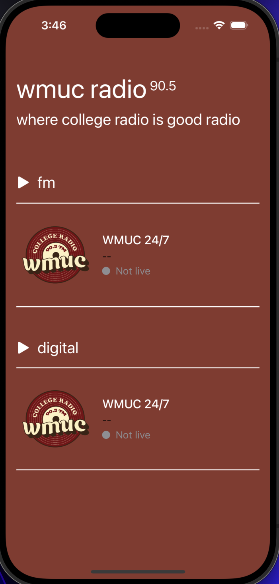
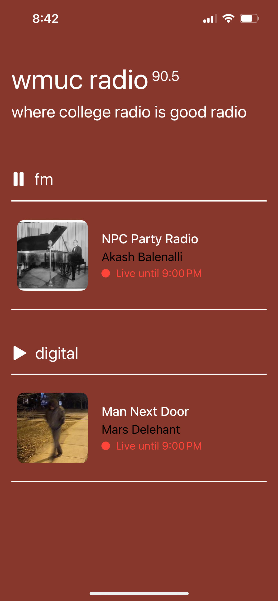

# WMUC Radio – iOS App

Lets listeners stream WMUC‑FM (90.5 FM) and WMUC‑Digital wherever they are, with live show metadata, lock‑screen controls, and background audio.

## Features

- **Live Streaming** – Listen to WMUC FM (90.5) and Digital channels while app is in background.
- **Now Playing Info** – Displays live show titles, DJ names, and cover art.
- **Lock Screen & Control Center Support** – See what’s playing directly from your lock screen or Control Center.
- **Automatic Show Refreshing** – Show info refreshes every hour to stay accurate.

## Project Structure

```text
WMUC‑iOS
├── Models
│   ├── CurrentShowPayload.swift   # JSON → model
│   ├── CurrentFMShow.swift       # ObservableObject FM view‑model
│   ├── CurrentDigitalShow.swift  # ObservableObject Digital view‑model
│   ├── AudioManager.swift        # Playback + Now Playing
│   └── …
├── Views
│   ├── HomePageView.swift        # Main UI
│   ├── CurrentShowWidget*.swift  # Reusable widgets
│   └── …
└── Radio_practiceApp.swift       # App entry point
```

## Goals for future

- [ ] Add full schedule browsing support
- [ ] Loading page art contest

## Current Design

| No live shows                             | Currently live                            |
|--------------------------------------------|-------------------------------------------|
|          |        |
